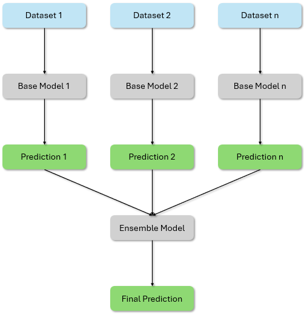
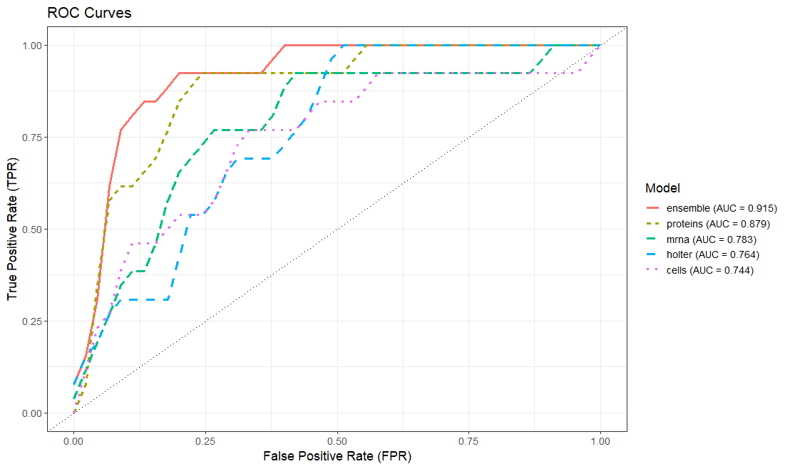
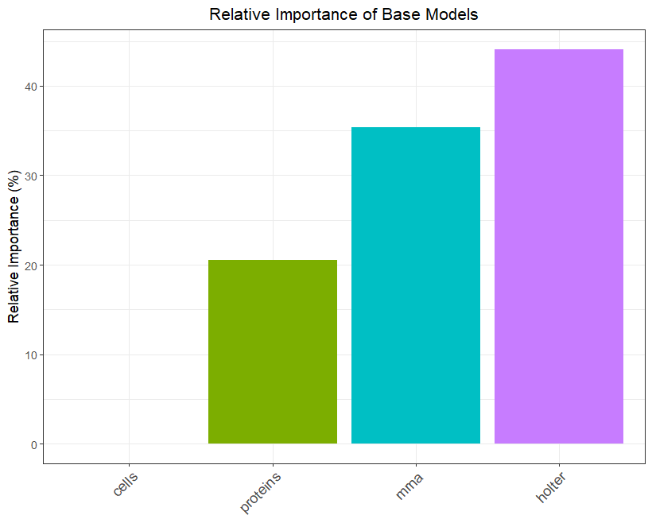
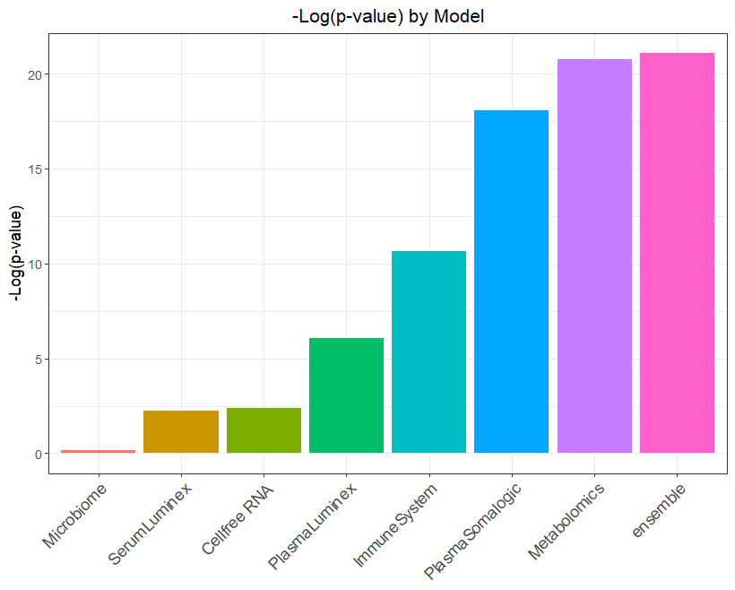

<!-- badges: start -->

[](https://app.codecov.io/gh/JoshD898/caretMultimodal)
[](https://github.com/JoshD898/caretMultimodal/actions/workflows/R-CMD-check.yaml)
[](https://www.codefactor.io/repository/github/joshd898/caretmultimodal)


<!-- badges: end -->

# caretMultimodal

**caretMultimodal** builds on the [caret](https://github.com/topepo/caret) package to make it 
easy to train, combine, and interpret models from multiple datasets or modalities. The package implements a data integration technique called **late fusion**, where base models are trained 
independently on each dataset, and their predictions are then aggregated using an ensemble model.

This work is inspired by Zach Mayer's [caretEnsemble](https://github.com/zachmayer/caretEnsemble) package, 
which is used for stacking multiple models on a single dataset.

<div style="text-align: center;">
  <p><strong>Late Fusion Workflow</strong></p>
  
</div>

## Key Features

- Includes all the functionality of **caret**, giving users full control over sampling strategies, training methods, hyperparameter tuning, and more  
- Default cross-validation structure with careful handling to prevent data leakage across modalities  
- Late fusion ensembling using stacked generalization  
- Parallelization for faster training across models and datasets  
- Model trimming to reduce memory usage for large ensembles  
- Built-in evaluation tools for performance assessment, ROC curves, and variable importance  
- Detailed error messages to simplify debugging


## Classification Example

For this classification example, we will use [these publicly available data
sets](https://amritsingh.shinyapps.io/omicsBioAnalytics/) on heart
failure, described in detail [here](https://pubmed.ncbi.nlm.nih.gov/30935638/). The data is included in the package, and can be loaded using `load_heart_failure()`.

We are going to use four related datasets (cells, holter, mrna and protein) to predict whether patients will be hospitalized in the 3 months following data collection.
This is an example of a binary classification task (Yes/No). We will use the **GLMNET** method to train both the base and ensemble models. For resampling, we will use the 
package default: 5-fold cross-validation with no repetitions.


``` r
set.seed(123L)
caretMultimodal::load_heart_failure()

# Set up hyperparameter tuning

alphas <- c(0.7, 0.775, 0.850, 0.925, 1)
lambdas <- seq(0.001, 0.1, by = 0.01)
tuneGrid <- expand.grid(alpha = alphas, lambda = lambdas)

# Train the base models

heart_models <- caretMultimodal::caret_list(
  target = demo$hospitalizations,
  data_list = list(
    cells = cells,
    holter = holter,
    mrna = mrna,
    proteins = proteins
  ),
  method = "glmnet",
  tuneGrid = tuneGrid
)

# Train the ensemble model

heart_stack <- caretMultimodal::caret_stack(
    caret_list = heart_models,
    method = "glmnet",
    tuneGrid = tuneGrid
)

```

`summary()` gives the resampling performance metrics for each base model and the ensemble using their best hyperparameter settings.

``` r
summary(heart_stack)
#>       model method alpha lambda       ROC      Sens       Spec      ROCSD     SensSD    SpecSD
#>      <char> <char> <num>  <num>     <num>     <num>      <num>      <num>      <num>     <num>
#> 1:    cells glmnet 0.850  0.091 0.7740741 0.9777778 0.00000000 0.14721931 0.04969040 0.0000000
#> 2:   holter glmnet 0.850  0.081 0.7851852 1.0000000 0.16666667 0.08842471 0.00000000 0.2357023
#> 3:     mrna glmnet 0.925  0.091 0.8111111 0.9777778 0.06666667 0.16789670 0.04969040 0.1490712
#> 4: proteins glmnet 0.700  0.001 0.8962963 0.9555556 0.46666667 0.09128709 0.06085806 0.4472136
#> 5: ensemble glmnet 0.925  0.071 0.9407407 0.9555556 0.40000000 0.06728112 0.09938080 0.2527625
```

There are built in functions to plot ROC curves on out-of-fold predictions, as well as visualize the relative importance of the base models.

``` r
plot_roc(heart_stack)
```



```r
plot_varimp(heart_stack, descending = FALSE)
```



## Regression Example

For this regression example, we will use [these publicly available datasets](https://nalab.stanford.edu/multiomics-pregnancy/) 
on gestational age, described in detail [here](https://doi.org/10.1093/bioinformatics/bty537). This data is included in the package, and can be loaded using `load_pregnancy()`.

We will use seven datasets to predict gestational age at time of blood sampling. Again, we will use the `GLMNET` method to train
both the base and ensemble models. We will do a bit of preprocessing of the data to remove postpartum samples, and use a custom 
trControl to implement leave-one-sample-out cross-validation.

``` r
set.seed(123L)
caretMultimodal::load_gestational_age()

# Remove postpartum samples

postpartum_indices <- which(featureweeks < 0)
InputData <- lapply(InputData, function(x) x[-postpartum_indices, ])
featurepatients <- featurepatients[-postpartum_indices]
featureweeks <- featureweeks[-postpartum_indices]

# Set up hyperparameter tuning

alphas <- seq(0, 1, 0.1)
lambdas <- seq(0, 12, by = 0.5)
tuneGrid <- expand.grid(alpha = alphas, lambda = lambdas)

# Set up trControl for leave-one-sample-out cross-validation

loso_folds <- caret::groupKFold(featurepatients, k = length(unique(featurepatients)))

trControl <- trainControl(
  method = "cv",
  index = loso_folds,
  savePredictions = "final",
  summaryFunction = caret::defaultSummary
)

# Train the base models

pregnancy_models <- caretMultimodal::caret_list(
  data_list = InputData,
  target = featureweeks,
  method = "glmnet",
  tuneGrid = tuneGrid,
  trControl = trControl
)

# Train the ensemble model

pregnancy_stack <- caretMultimodal::caret_stack(
  pregnancy_models,
  method = "glmnet",
  tuneGrid = tuneGrid,
  trControl = trControl
)

```

`oof_predictions()` returns the out-of-fold predictions for the base and ensemble models

```r
oof_predictions(pregnancy_stack)

#>    Cellfree RNA PlasmaLuminex SerumLuminex Microbiome ImmuneSystem Metabolomics PlasmaSomalogic   ensemble
#> 1      14.40391    18.1430558    14.932066  15.869220    16.269368    13.410669       11.833937 13.2816177
#> 2      14.61495    12.7016107    19.211904  12.621349    18.867984    13.998000       13.150318 15.5780514
#> 3      13.59511     7.9551468    14.441999  15.841214    22.322011    12.899592        8.822440 10.1224647
#> 4      15.51295    11.0755650    14.557425  10.926614    10.818393    13.248870        8.705712  8.8447452
#> 5      14.72063    16.7378848     6.824721  15.941069    12.202590    15.744880       11.568229 11.1975881
#>             ...           ...          ...        ...          ...          ...             ...        ...
```

`plot_metric()` applies any custom comparison function is put in and plots the results. For example, the plot below 
shows the −log₁₀(p-value) from a Spearman correlation between each model’s predictions and the observed gestational age.

```r
plot_metric(
  pregnancy_stack,
  metric_function = function(x,y) -log10(cor.test(x,y, method = "spearman")$p.value),
  metric_name = "-Log(p-value)"
)

```


## Installation

The package can be installed using devtools

``` r
devtools::install_github("JoshD898/caretMultimodal")
```
